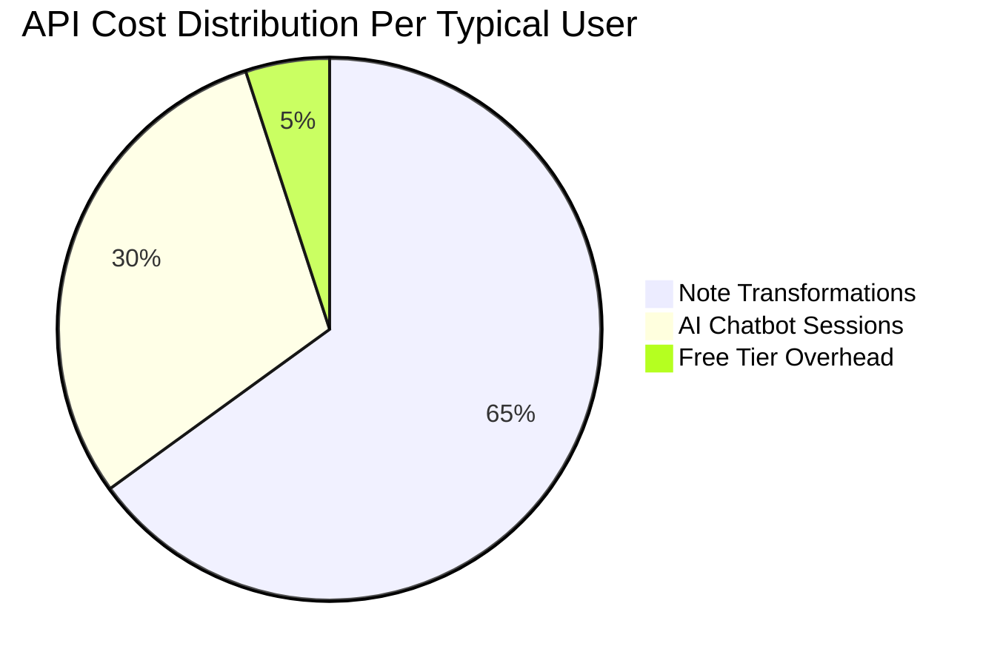

# Notrik — Complete Gemini API Usage & Cost Audit

## 1. API Key Configuration

| Item | Details |
|------|---------|
| **Environment Variable** | `GEMINI_API_KEY` |
| **Location** | [.env.local](file:///c:/Users/rahul123/Notesnap/notesnap-app/.env.local) |
| **Number of Keys** | **1 single key** used everywhere |
| **Key Count in Codebase** | Used in 2 production routes + 3 dev-only test scripts |

> [!CAUTION]
> Your API key is **hardcoded in plaintext** inside `test-models.js` and `list-models.js`. These files are likely committed to Git. **Rotate your key immediately** and add these files to `.gitignore`, or delete them entirely before any public deployment.

---

## 2. All API Usage Locations

### 🔴 PRODUCTION — These Cost You Money Per User

#### Endpoint 1: Note Transformation API
| Field | Value |
|-------|-------|
| **File** | [route.ts](file:///c:/Users/rahul123/Notesnap/notesnap-app/src/app/api/transform/route.ts) |
| **Path** | `POST /api/transform` |
| **Model** | `gemini-3.5-flash` |
| **SDK** | `@google/generative-ai` → `GoogleGenerativeAI` |
| **Config** | `responseMimeType: "application/json"` (forces structured JSON output) |
| **Purpose** | **Core product feature.** Takes user-uploaded images/PDFs/text → sends to Gemini Vision → returns structured JSON (notes, flashcards, or quizzes) |
| **Input Types** | Images (base64 inline data), PDFs, plain text |
| **Output Formats** | Structured Notes JSON, Smart Flashcards JSON, Practice Quiz JSON |
| **Retry Logic** | 3 retries on 503 errors with exponential backoff |
| **Called From** | [dashboard/page.tsx](file:///c:/Users/rahul123/Notesnap/notesnap-app/src/app/dashboard/page.tsx#L128) — the main "Execute" transform button |

#### Endpoint 2: AI Chatbot / Mentor API
| Field | Value |
|-------|-------|
| **File** | [route.ts](file:///c:/Users/rahul123/Notesnap/notesnap-app/src/app/api/chat/route.ts) |
| **Path** | `POST /api/chat` |
| **Model** | `gemini-3.5-flash` |
| **SDK** | `@google/generative-ai` → `GoogleGenerativeAI` |
| **Config** | `systemInstruction` with detailed Notrik AI Mentor persona |
| **Purpose** | **Global chatbot.** Multi-turn conversational AI mentor. Answers academic doubts, explains concepts with Feynman technique, uses LaTeX. |
| **Conversation Style** | Multi-turn chat with full `history` array sent each request |
| **Called From** | [Chatbot.tsx](file:///c:/Users/rahul123/Notesnap/notesnap-app/src/components/Chatbot.tsx#L65) — the floating "Ask AI Mentor" widget (visible on ALL pages except auth) |

---

### 🟢 DEV-ONLY — These Don't Affect Production Costs

| File | Model | Purpose | Risk |
|------|-------|---------|------|
| [test-models.js](file:///c:/Users/rahul123/Notesnap/notesnap-app/test-models.js) | `gemini-pro` | Simple "hello" test to validate API connectivity | ⚠️ **Hardcoded API key** |
| [test-chat.js](file:///c:/Users/rahul123/Notesnap/notesnap-app/test-chat.js) | N/A (calls `/api/chat` via `fetch`) | Tests the chat endpoint locally | Safe (uses env key via server) |
| [list-models.js](file:///c:/Users/rahul123/Notesnap/notesnap-app/list-models.js) | N/A | Lists available Gemini models via REST API | ⚠️ **Hardcoded API key** |

### 🔵 NON-AI API Routes — No Gemini Costs

These API routes exist but do **NOT** call Gemini (they're data/CRUD endpoints):

| Route | Purpose |
|-------|---------|
| `/api/notes/[id]` | Fetch/serve stored note data from local DB |
| `/api/flashcards/*` | CRUD for flashcard decks & cards |
| `/api/folders/*` | Folder management |
| `/api/library` | Library listing |
| `/api/feedback` | User feedback submission |
| `/api/subfolders` | Subfolder management |

---

## 3. Gemini 3.5 Flash — Current Pricing (June 2026)

| Metric | Price (USD) | Price (INR @ ₹85/USD) |
|--------|-------------|----------------------|
| **Input tokens** | $1.50 / 1M tokens | **₹127.50 / 1M tokens** |
| **Output tokens** | $9.00 / 1M tokens | **₹765.00 / 1M tokens** |
| **Image input** | Same as text ($1.50/1M tokens) | ₹127.50 / 1M tokens |
| **Context Caching** | $0.15 / 1M tokens (cache hits) | ₹12.75 / 1M tokens |

> [!IMPORTANT]
> Your code comments on lines 5-9 of `transform/route.ts` reference **old pricing** for `gemini-1.5-flash` ($0.075 input / $0.30 output per 1M). The actual model being used is `gemini-3.5-flash` which is **20x more expensive on input** and **30x more expensive on output**. Your cost tracking in the app is currently **severely underestimating** real costs.

---

## 4. Per-Request Cost Estimates

### 4A. Note Transformation (`/api/transform`)

This is your **heaviest** API call. Each request involves:

| Component | Estimated Tokens | Rationale |
|-----------|-----------------|-----------|
| **System Prompt** | ~1,200 - 1,500 tokens | The massive structured JSON schema + rules + LaTeX instructions |
| **Image Input** | ~1,000 - 5,000 tokens | Depends on image resolution. A typical phone photo of notes ≈ 2,000-3,000 tokens. A compressed 1500px image ≈ 1,500-2,500 tokens |
| **Text Input** (if paste) | ~200 - 2,000 tokens | Depends on how much text the user pastes |
| **Total Input** | **~2,500 - 6,500 tokens** | — |
| **Output (Structured Notes)** | ~3,000 - 8,000 tokens | Full JSON with concepts, formulas, diagrams, questions, examples |
| **Output (Flashcards)** | ~2,000 - 5,000 tokens | 10-15 flashcards in JSON |
| **Output (Practice Quiz)** | ~2,000 - 4,000 tokens | Multiple quiz questions in JSON |

#### Cost Per Transformation Request (INR):

| Scenario | Input Tokens | Output Tokens | Input Cost (₹) | Output Cost (₹) | **Total (₹)** |
|----------|-------------|---------------|----------------|-----------------|---------------|
| **Light** (small text, flashcards) | 2,500 | 2,000 | ₹0.32 | ₹1.53 | **₹1.85** |
| **Typical** (image, structured notes) | 4,000 | 5,000 | ₹0.51 | ₹3.83 | **₹4.34** |
| **Heavy** (large image, full notes) | 6,500 | 8,000 | ₹0.83 | ₹6.12 | **₹6.95** |

> [!TIP]
> **Safe working estimate for budgeting: ₹4-5 per transformation.**

---

### 4B. AI Chatbot (`/api/chat`)

This is trickier because it's **multi-turn** — each message sends the **entire conversation history** again.

| Turn | Input Tokens (cumulative) | Output Tokens | Input Cost (₹) | Output Cost (₹) | **Total (₹)** |
|------|--------------------------|---------------|----------------|-----------------|---------------|
| **1st message** | ~200 (system + user msg) | ~300 | ₹0.03 | ₹0.23 | **₹0.26** |
| **5th message** | ~2,000 (history grows) | ~300 | ₹0.26 | ₹0.23 | **₹0.49** |
| **10th message** | ~5,000 | ~400 | ₹0.64 | ₹0.31 | **₹0.95** |
| **20th message** | ~12,000 | ~500 | ₹1.53 | ₹0.38 | **₹1.91** |

**For a typical chat session (5-10 messages):**

| Metric | Value |
|--------|-------|
| **Total input tokens across all turns** | ~8,000-15,000 |
| **Total output tokens across all turns** | ~2,000-4,000 |
| **Total session cost** | **₹2-5 per session** |

> [!WARNING]
> **The chatbot is an unbounded cost risk.** There's no limit on messages per session or sessions per day. A single power user sending 50 messages could cost you ₹10-15 in one sitting. You **must** implement message limits per session/day before launch.

---

## 5. Per-User Monthly Cost Projection

### Scenario: Typical Indian Student User

| Usage Pattern | Frequency | Cost per action | **Monthly Cost (₹)** |
|---------------|-----------|----------------|---------------------|
| **Note transformations** | 15-20 / month | ₹4.34 avg | **₹65 - ₹87** |
| **Chat sessions** | 10-15 sessions / month (5 msgs each) | ₹3 avg | **₹30 - ₹45** |
| **Total per user** | — | — | **₹95 - ₹132** |

### Scenario: Heavy User (Exam Season Crammer)

| Usage Pattern | Frequency | Cost per action | **Monthly Cost (₹)** |
|---------------|-----------|----------------|---------------------|
| **Note transformations** | 40-60 / month | ₹5 avg | **₹200 - ₹300** |
| **Chat sessions** | 30+ sessions / month (10 msgs each) | ₹5 avg | **₹150** |
| **Total per user** | — | — | **₹350 - ₹450** |

### Scenario: Casual/Free Tier User (5 transformations cap)

| Usage Pattern | Frequency | Cost per action | **Monthly Cost (₹)** |
|---------------|-----------|----------------|---------------------|
| **Note transformations** | 5 (cap) | ₹4.34 avg | **₹22** |
| **Chat sessions** | 3-5 sessions | ₹3 avg | **₹9 - ₹15** |
| **Total per user** | — | — | **₹31 - ₹37** |

---

## 6. Critical Issues for Pricing Decisions

### 🔴 Issue 1: Cost Tracker in Code is WRONG

```diff
- // Estimated pricing for gemini-1.5-flash (Approximate in USD to INR)
- // $0.075 per 1M input tokens => ~6.2 INR per 1M
- // $0.30 per 1M output tokens => ~25 INR per 1M
- const INPUT_COST_PER_MILLION_INR = 6.2;
- const OUTPUT_COST_PER_MILLION_INR = 25.0;
+ // Actual pricing for gemini-3.5-flash (June 2026)
+ // $1.50 per 1M input tokens => ~127.50 INR per 1M
+ // $9.00 per 1M output tokens => ~765.00 INR per 1M
+ const INPUT_COST_PER_MILLION_INR = 127.5;
+ const OUTPUT_COST_PER_MILLION_INR = 765.0;
```

Your `estimatedCostINR` stored in each note is currently **~20-30x lower** than reality.

### 🔴 Issue 2: Chatbot Has No Usage Limits

The chatbot is available on every page and has **zero throttling**:
- No max messages per session
- No max sessions per day
- No rate limiting
- History grows unbounded (token cost escalates linearly)

### 🟡 Issue 3: No Per-User Tracking

Right now `userId` is hardcoded to `'anonymous-session'`. You can't attribute costs to individual users until you integrate authentication (Supabase).

### 🟡 Issue 4: Hardcoded API Keys in Test Scripts

Both `test-models.js` and `list-models.js` have a **different** API key hardcoded in them (different from `.env.local`). If these are committed to Git, that key is compromised.

---

## 7. Pricing Recommendations for Profitability

### Minimum Viable Pricing Math

| Tier | Transform Limit | Chat Limit | Your API Cost | **Minimum Price (₹)** | **Suggested Price (₹)** |
|------|----------------|------------|---------------|----------------------|------------------------|
| **Free** | 5 total (one-time) | 15 msgs/day | ~₹35 one-time | ₹0 (acquisition) | ₹0 |
| **Starter** (monthly) | 30 / month | 50 msgs/day | ~₹165/mo | ₹200+/mo | **₹249/mo** |
| **Pro** (monthly) | 100 / month | Unlimited (capped 200/day) | ~₹550/mo | ₹700+/mo | **₹499-599/mo** |
| **Unlimited** (monthly) | Unlimited | Unlimited | Variable | Risk of abuse | **₹999/mo** (with fair use) |

> [!IMPORTANT]
> **To be profitable at ₹249/mo for Starter, you need:**
> - Transform limit of ~30/month (cost: ~₹130)
> - Chat limit of ~50 msgs/day (cost: ~₹35/mo if they use it daily)
> - That gives you **~₹84 gross margin** (~34%) before server/infra costs
>
> **At ₹499/mo for Pro:**
> - 100 transforms + heavy chat ≈ ₹550 cost → you're **barely breaking even**
> - You need to either raise the price to ₹699, or limit transforms to 80/month

### Cost Reduction Strategies

1. **Context Caching** — For the chatbot's `systemInstruction`, use Gemini's context caching ($0.15/1M vs $1.50/1M) to save 10x on the system prompt portion
2. **Batch API** — For non-urgent transformations, use the batch/flex API (50% discount)
3. **Message limits** — Cap chat to 20 messages/session, auto-clear history after
4. **Token budgets** — Set `maxOutputTokens` in generation config (e.g., 4096) to prevent runaway outputs
5. **Use Gemini 2.0 Flash** for chatbot — If a cheaper/faster model is available for simple Q&A, downgrade the chatbot model while keeping the premium model for transformations

---

## 8. Summary Table — Where Your Money Goes



| Feature | Model | Avg Cost/Request (₹) | % of Total Cost | Risk Level |
|---------|-------|----------------------|----------------|------------|
| **Note Transform** | gemini-3.5-flash | ₹4.34 | ~65% | 🟢 Controlled (credit-gated) |
| **AI Chatbot** | gemini-3.5-flash | ₹0.26-1.91/msg | ~30% | 🔴 Unbounded (no limits) |
| **Test Scripts** | gemini-pro | Negligible | 0% | 🟡 Security risk only |
